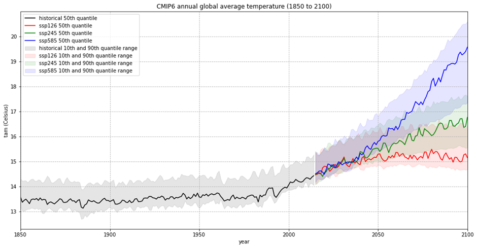
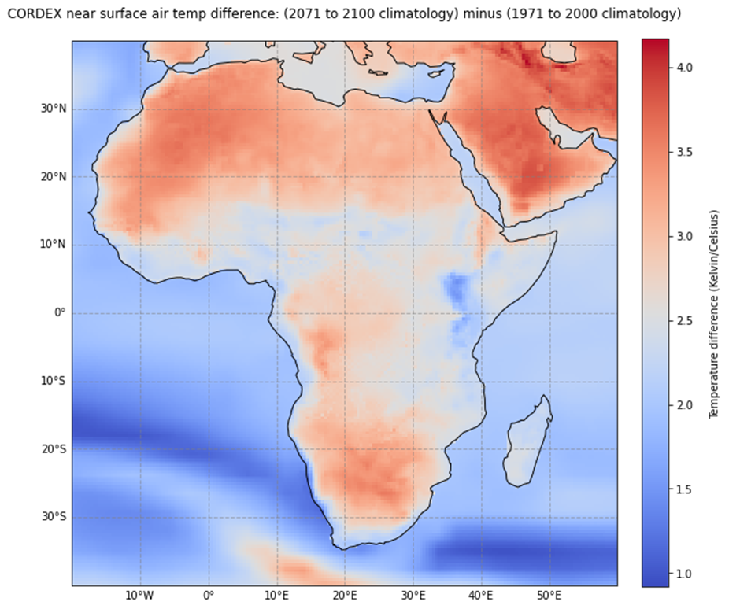

# Climate Projections Tutorial

**PLEASE NOTE THAT THIS A DEVELOPMENT INSTANCE, THESE NOTE BOOKS ARE OFFICIALLY PUBLISHED ELSEWHERE**

This Jupyter book is a sub-module of the core C3S training material, it is published here for reviewing the
content prior to publication.

## Overview of Climate Projections

Climate projections are essential tools for understanding potential future changes in the Earth's climate system. This tutorial provides an overview of climate projections, explaining their significance, methodologies, and applications in climate science and policy-making.

## [Global Climate Projections (CMIP6)](../projections-cmip6.ipynb)

This notebook provides a practical introduction on how to access and process [CMIP6 global climate projections](https://cds.climate.copernicus.eu/cdsapp#!/dataset/projections-cmip6?tab=overview) data available in the Climate Data Store (CDS) of the Copernicus Climate Change Service (C3S). The workflow shows how to compute and visualize the output of an ensemble of models for the annual global average temperature between 1850 to 2100. You will use the `historical` experiment for the temporal period 1850 to 2014 and the three scenarios `SSP1-2.6`, `SSP2-4.5` and `SSP5-8.5` for the period from 2015 to 2100.

## [Regional Climate Projections (CORDEX)](../projections-cordex.ipynb)

This notebook is a practical introduction to [CORDEX regional climate model data on single levels](https://cds.climate.copernicus.eu/cdsapp#!/dataset/projections-cordex-domains-single-levels?tab=overview). CORDEX data are available for 14 regional domains and variable spatial resolutions, from 0.11 x 0.11 degrees up to 0.44 x 0.44 degrees. This workflow will demonstrate how to compute the difference in the air temperature climatology for 2071-2100 (according to a projected scenario) relative to the reference period 1971-2000 in Africa, with a spatial resolution of 0.44 x 0.44 degrees.

